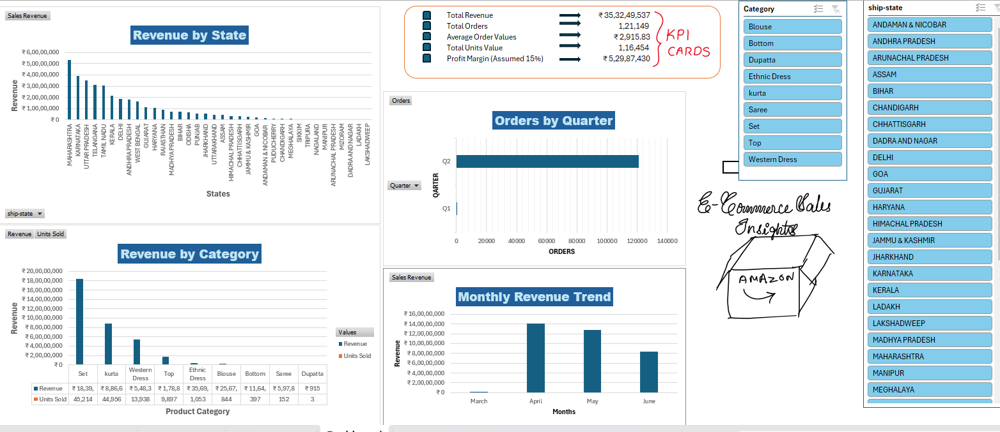

# Amazon-Sales-Analysis-Excel
This project analysis Amazon e-commerce sales data using Microsoft Excel. An interactive dashboard was built using Pivot Tables, Pivot Charts, and Slicers to uncover insights related to revenue, order volume, product categories, regional performance, and seasonal trends.

## 📂 Project Files
Due to GitHub file size limits, large Excel files are hosted externally.

- 📊 Master Excel Dashboard File:  
  👉 [Download here](https://docs.google.com/spreadsheets/d/1qSwGfMWo1aEQjx2xCSxB0ztfB1QiwsrL/edit?usp=sharing&ouid=117454884536357599895&rtpof=true&sd=true)

- 🗃 Raw Dataset:  
  👉 [Download here](https://drive.google.com/file/d/1Rohi-D9TNtaTvsdX-sWHQErArKfwP4xw/view?usp=sharing)
  
## Dashboard Overview

## Project Objective
The objective of this project is to:
- Analyze sales performance across states, product categories, months, and quarters.
- Identify high-revenue regions and products.
- Evaluate seasonal trends in orders and revenue.
- Present insights through a clean, interactive Excel dashboard.
- Provide business recommendations based on data findings.

  ## Data Cleaning & Preparation
  The following steps were performed before analysis:
  - Removed blank and inconsistent records.
  - Standardized category and state names.
  - Converted date fields into Month, Quarter, and Year.
  - Created derived fields for analytical purposes.
  - Ensured consistent currency and numeric formatting.
 
    ## Key Performance Indicators (KPIs)
    The dashboard focuses on the following KPIs:
    - Total Revenue
    - Total Orders
    - Average Order Value (AOV)
    - Total Units Sold
    - Profit Margin (Assumed 15%)
   
    > [Note:]
    > As the dataset did not include profit information, a uniform 15% profit margin was assumed across all transactions for analytical purposes.

    ## Key Insights
    - Maharashtra contributes the highest share of total revenue among all states.
    - Set, Kurta, and Western Dress categories drive the majority of category-level revenue.
    - April and May show peak monthly revenue, followed by a moderate decline in June.
    - Q2 significantly outperforms Q1 in terms of total orders and revenue contribution.
   
    ## Business Recommendations
    - Introduce targeted promotions in Q1 to improve order volume during low-demand periods.
    - Apply dicounts and focused marketing on low-performing categories such as Ethnic Wear and Sarees.
    - Increase marketing spend in high-revenue states (e.g., Maharashtra, Karnataka, Uttar Pradesh) to maximize ROI.
    - Re-evaluate product mix in low-revenue regions (e.g., Lakshadweep, Mizoram, Nagaland) and consider promoting Western wear in regions with lower demand for traditional apparel.
   
    ## Tools & Techniques Used
    - Microsoft Excel
    - Data Cleaning & Transformation
    - Pivot Tables
    - Pivot Charts
    - Interactive Slicers
    - Dashboard Design
   
    ## Conclusion
    - This project demonstrates how Microsoft Excel can be effectively used for end-to-end data analysis from data cleaning to interactive dashboard creation while delivering meaningful buisness insights for e-commerce decision-making.
   
    ## Disclaimer:
    This project is for educational and portifolio purposes only.
